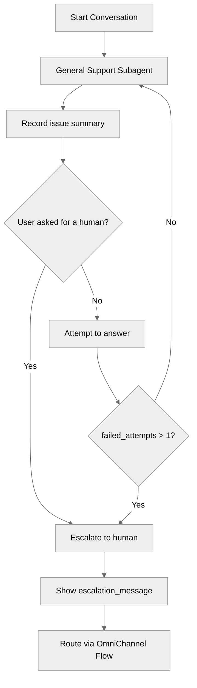

# EscalationPatterns

## Overview

Learn how to hand a conversation off to a human. Every production agent needs an exit
hatch: users must be able to reach a person when the agent cannot help, or simply when
they ask. This recipe shows the two halves of that pattern - a `connection messaging`
block that declares **where** the conversation is routed, and a gated `@utils.escalate`
action that controls **when** the handoff happens.

## Agent Flow



## Key Concepts

- **`connection messaging` Block**: Top-level block that declares the escalation destination (`outbound_route_type`, `outbound_route_name`) and the message shown at handoff (`escalation_message`).
- **`@utils.escalate`**: The utility action that performs the handoff. It takes no target - its destination comes from `connection messaging`.
- **Gated Escalation**: An `available when` condition keeps the escalation action hidden until an escalation trigger fires, so the agent cannot abandon the conversation early.
- **Escalation Triggers as State**: Each trigger is a variable the agent sets deliberately (`user_requested_human`, `failed_attempts`), which makes the handoff rule explicit and testable instead of left to the model's judgment.
- **Handoff Context**: `issue_summary` captures what the user needs so the human does not start from zero.

## How It Works

### 1. Declare the Escalation Destination

`connection messaging` is a top-level block, declared once. It is what gives
`@utils.escalate` somewhere to go - without it, the action has no destination.

```agentscript
connection messaging:
   description: "Routes escalated conversations to a human support queue"
   escalation_message: "I am connecting you with a human agent who can help you further."
   outbound_route_type: "OmniChannelFlow"
   outbound_route_name: "AgentSupportFlow"
```

The block belongs after `system` in top-level block order (`config` → `variables` →
`system` → `connection`). Note the block is `connection messaging`, singular - a
`connections:` block is not valid Agent Script and fails compilation.

`outbound_route_type` accepts `"OmniChannelFlow"`, and `outbound_route_name` must match
an Omni-Channel routing flow in the target org.

### 2. Track Why an Escalation Would Happen

Escalation triggers are ordinary mutable variables rather than a judgment the model makes
in the moment. That keeps the rule inspectable, and lets the same condition be reused in
both the instructions and the action gate.

```agentscript
variables:
   user_requested_human: mutable boolean = False
      description: "Whether the user has explicitly asked to speak with a human"

   failed_attempts: mutable number = 0
      description: "How many times the agent has failed to resolve the user's question"
```

The agent sets them through `@utils.setVariables`, including an arithmetic increment for
the attempt counter:

```agentscript
note_human_request: @utils.setVariables
   description: "Record that the user explicitly asked for a human"
   with user_requested_human = True

note_failed_attempt: @utils.setVariables
   description: "Record that the agent could not resolve the user's question"
   with failed_attempts = @variables.failed_attempts + 1
```

### 3. Gate the Handoff

`available when` hides `escalate_to_human` until a trigger fires. This is the guardrail:
the agent physically cannot select the escalation action while it is still expected to
try, which prevents it from escalating on the first difficult question.

```agentscript
escalate_to_human: @utils.escalate
   description: "Hand the conversation to a human agent"
   available when @variables.user_requested_human == True or @variables.failed_attempts > 1
```

### 4. Announce the Handoff Before It Happens

Procedural instructions react to the same variables, so the user hears why they are being
transferred instead of being moved silently:

```agentscript
if @variables.user_requested_human == True:
   | The user has asked for a human. Acknowledge the request, confirm the issue as "{!@variables.issue_summary}" so the handoff carries context, then hand off with {!@actions.escalate_to_human}.

if @variables.failed_attempts > 1:
   | You have failed to resolve this twice. Acknowledge that you are not the right help here, restate the issue as "{!@variables.issue_summary}" for the human taking over, then hand off with {!@actions.escalate_to_human}.
```

Interpolating `issue_summary` here is what makes that variable pay for itself: the summary
the agent recorded earlier is read back out at the moment of handoff, so the context is
visible in the transcript the human inherits rather than sitting unused in state.

## Key Code Snippets

### Complete Escalation Configuration

```agentscript
connection messaging:
   description: "Routes escalated conversations to a human support queue"
   escalation_message: "I am connecting you with a human agent who can help you further."
   outbound_route_type: "OmniChannelFlow"
   outbound_route_name: "AgentSupportFlow"
```

### Complete Action Set

```agentscript
actions:
   record_issue: @utils.setVariables
      description: "Save a one-line summary of the user's issue"
      with issue_summary = ... # One-line summary of what the user needs

   note_human_request: @utils.setVariables
      description: "Record that the user explicitly asked for a human"
      with user_requested_human = True

   note_failed_attempt: @utils.setVariables
      description: "Record that the agent could not resolve the user's question"
      with failed_attempts = @variables.failed_attempts + 1

   escalate_to_human: @utils.escalate
      description: "Hand the conversation to a human agent"
      available when @variables.user_requested_human == True or @variables.failed_attempts > 1
```

## Try It Out

Deploy the bundle, then start a preview session. Escalation routing only completes in an
org with the Omni-Channel routing flow named in `outbound_route_name` - see [Notes](#notes).

### Example Interaction: Explicit Request

```text
Agent: Hi! I'm here to help. If you'd rather talk to a person, just ask.

User: Can I speak to a human please?

Agent: Of course - let me get someone for you.

Agent: I am connecting you with a human agent who can help you further.
```

### Behind the Scenes

1. The agent calls `note_human_request`, setting `user_requested_human` to `True`.
2. That satisfies the `available when` gate, so `escalate_to_human` becomes selectable.
3. The instructions block tells the agent to acknowledge the request first.
4. `@utils.escalate` runs, the `escalation_message` is shown, and the conversation is routed to the Omni-Channel flow.

### Example Interaction: Repeated Failure

```text
Agent: Hi! I'm here to help. If you'd rather talk to a person, just ask.

User: Why was my invoice adjusted retroactively last quarter?

Agent: I'm not able to find an answer to that. Could you rephrase it for me?

User: The retroactive adjustment on last quarter's invoice - why did it happen?

Agent: I'm sorry, this isn't something I can resolve. Let me bring in someone who can.

Agent: I am connecting you with a human agent who can help you further.
```

### Behind the Scenes

1. Each unresolved turn calls `note_failed_attempt`, incrementing `failed_attempts`.
2. On the second failure `failed_attempts` becomes `2`, satisfying `failed_attempts > 1`.
3. `escalate_to_human` becomes available and the agent hands off.
4. `issue_summary` carries the user's question across, so the human has context.

## What's Next

- **SafetyAndGuardrails**: Gate destructive actions behind explicit user confirmation.
- **ErrorHandling**: Validate inputs and stop early with guard clauses.
- **AvailableWhenFiltering**: Build more complex action availability conditions.
- **MultiSubagentNavigation**: Route between subagents before falling back to a human.

## Testing

### Test Case 1: No Escalation Offered Early

Ask a normal question the agent can answer. `escalate_to_human` should not be selected -
the gate is closed because both triggers are still at their defaults.

### Test Case 2: Explicit Request

Say "I want to talk to a person." The agent should set `user_requested_human` to `True`,
acknowledge the request, then escalate.

### Test Case 3: Single Failure Does Not Escalate

Ask one unanswerable question. `failed_attempts` becomes `1`, which does **not** satisfy
`failed_attempts > 1`, so the agent should try again rather than hand off.

### Test Case 4: Repeated Failure

Ask two unanswerable questions in a row. On the second, `failed_attempts` reaches `2` and
the agent should escalate.

## Notes

- **Prerequisite - Omni-Channel routing flow**: `outbound_route_name` must name an Omni-Channel routing flow that exists in the target org. The name in this recipe, `AgentSupportFlow`, is a placeholder; change it to a routing flow in your org, or create one, before expecting a handoff to complete. The bundle compiles and deploys either way, but escalation cannot route without it.
- **Escalation needs a messaging surface**: `connection messaging` describes a messaging deployment. In a preview session you can observe the gate opening and the `escalation_message` being sent, but the actual transfer to a human requires the agent to be deployed to a messaging channel with Omni-Channel routing configured.
- **`connection`, not `connections`**: the block is singular and takes a label (`connection messaging`). `connections:` is not valid Agent Script.
- **`@utils.escalate` takes no target**: unlike `@actions.*`, it has no `target:` and no inputs. Its destination comes entirely from `connection messaging`.
- **Block order**: `connection` comes after `system` in top-level block order.
